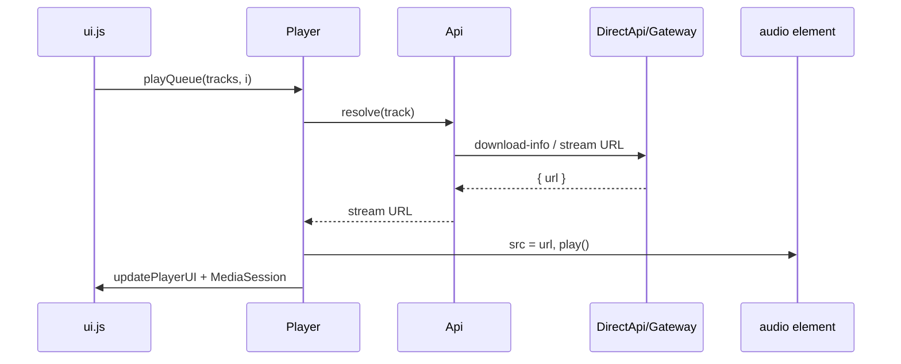
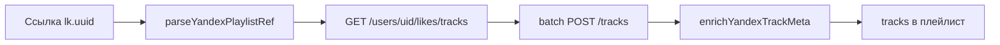

# Nexory iOS — полное руководство

Документ описывает **только мобильное приложение Nexory** для iPhone/iPad: архитектура, экраны, API, плеер, темы, импорт, сборка и типичные проблемы.

**Актуальная версия:** v1.0.63+  
**Репозиторий:** [ioqeeqo-create/NexoryIos](https://github.com/ioqeeqo-create/NexoryIos)  
**Связанные проекты:** Desktop — `flow_fixed/` (Electron); Gateway — `flow_fixed/server/flow-mobile-gateway.js`

---

## 1. Что это за приложение

Nexory iOS — музыкальный клиент в стиле **Dotify**: тёмный интерфейс, шрифт **Minecraft**, розовый акцент по умолчанию (`#ec4899`), вкладки внизу.

| Возможность | Поддержка |
|-------------|-----------|
| Яндекс Музыка (поиск, волна, импорт) | Да, OAuth на устройстве |
| VK Музыка (поиск) | Да, токен на устройстве |
| SoundCloud (поиск, главная, воспроизведение) | Да, Client ID (авто или вручную) |
| «Моя волна» (Yandex Rotor) | Да |
| Локальные плейлисты, лайки, недавние | Да, `localStorage` |
| YouTube | Нет |
| Соц. комнаты Desktop | Нет |

Приложение **не требует постоянно включённый ПК**, если на телефоне настроены токены. VPS/домашний ПК с **Gateway** нужен для запасного resolve, импорта VK, тяжёлого SoundCloud и текстов песен.

---

## 2. Технологический стек

```
┌─────────────────────────────────────────────────────────────┐
│  iOS (UIKit + WKWebView)                                    │
│  Capacitor 6 — нативная оболочка                            │
└───────────────────────────┬─────────────────────────────────┘
                            │
┌───────────────────────────▼─────────────────────────────────┐
│  www/  — HTML + CSS + JavaScript (без React/Vue)            │
│  index.html, css/app.css, js/*.js                           │
└───────────────────────────┬─────────────────────────────────┘
                            │
         ┌──────────────────┼──────────────────┐
         ▼                  ▼                  ▼
   CapacitorHttp      @capacitor/browser    App URL scheme
   (обход CORS)       OAuth SC              nexory://
         │                  │
         ▼                  ▼
   api.music.yandex.net   secure.soundcloud.com
   api.vk.com / api.vk.ru
   api-v2.soundcloud.com
         │
         ▼ (опционально)
   flow-mobile-gateway :3950
```

| Компонент | Версия / путь |
|-----------|----------------|
| Capacitor | 6.x, `capacitor.config.json` |
| App ID | `app.nexory.mobile` |
| Web root | `www/` |
| Нативный проект | `ios/` (генерируется `cap add ios`, не в git) |
| Шрифт | `www/fonts/minecraft.ttf` |
| CI | `.github/workflows/build-ipa.yml` |
| Скрипт сборки | `scripts/build-ios.sh` |

**Плагины Capacitor:**

- **CapacitorHttp** — HTTP-запросы в обход ограничений WKWebView (`fetch` на iOS часто даёт «Load failed»).
- **Browser** — открытие OAuth SoundCloud во внешнем браузере (не `window.open` → `about:blank`).
- **App** — deep link `nexory://oauth/soundcloud` после OAuth.

---

## 3. Структура `www/`

### 3.1 Порядок загрузки скриптов (`index.html`)

```
icons.js → viewport.js → config.js → store.js → theme.js
→ http.js → direct-api.js → api.js → lyrics.js → player.js → bridge.js → ui.js → app.js
```

### 3.2 Модули JavaScript

| Файл | Глобал | Назначение |
|------|--------|------------|
| `app.js` | — | Точка входа: splash → `UI.init()` |
| `ui.js` | `UI` | Все экраны, импорт, настройки, жесты плеера |
| `player.js` | `Player` | Очередь, `<audio>`, Media Session, волна |
| `store.js` | `Store` | Состояние в `localStorage` (`nexory_mobile_v1`) |
| `api.js` | `Api` | Гибрид direct / gateway / auto |
| `direct-api.js` | `DirectApi` | Прямые запросы к API провайдеров |
| `http.js` | `Http` | Обёртка: на iOS → CapacitorHttp, в браузере → fetch |
| `theme.js` | `Theme` | Темы, палитра с обложки, фон плеера |
| `bridge.js` | `Bridge` | OAuth URL + `appUrlOpen` |
| `config.js` | `NexoryConfig` | Настроения волны, темы, URL gateway по умолчанию |
| `lyrics.js` | `Lyrics` | Тексты (через gateway) |
| `icons.js` | `Icons` | SVG-иконки Lucide |
| `viewport.js` | `Viewport` | Клавиатура, safe area |

### 3.3 Ключевые DOM-слои

| ID / класс | Роль |
|------------|------|
| `#splash` | Заставка с орбитой из 3 точек |
| `#app-bg` | Глобальный градиентный фон |
| `#app-orbs` | Декоративные размытые шары |
| `#home-edge-glow` | Орбы, бегущие по краям главной |
| `#screens` | Контейнер вкладок (home / search / library / settings) |
| `#home-scroll-inner` | Вертикальная прокрутка главной |
| `#full-player` | Полноэкранный плеер |
| `#mini-player` | Мини-плеер над таб-баром |
| `.tab-bar` | Нижняя навигация |

---

## 4. Режимы работы с API

В настройках: **Режим API** (`apiMode` в Store).

| Режим | Поведение |
|-------|-----------|
| `direct` | Только запросы с телефона (`DirectApi` + `Http`) |
| `gateway` | Только VPS/ПК: `POST /mobile/v1/*` |
| `auto` | По умолчанию; см. таблицу операций |

### 4.1 Операции в режиме `auto` (`api.js`)

| Операция | Приоритет |
|----------|-----------|
| `search` | direct → gateway fallback |
| `resolve` (URL потока) | gateway для yandex/sc при наличии; иначе direct |
| `waveFetch` / `waveFeedback` | **gateway первым**, если настроен; иначе direct |
| `importPlaylist` | gateway; Яндекс при токене — также direct |
| `soundCloudChartKind` / `soundCloudMixes` | только direct |
| `discoverSoundCloudClientId` | только direct |
| `fetchLyrics` | gateway |
| `validateYandex` / `validateVk` | direct, fallback gateway |

Gateway: заголовок `Authorization: Bearer {gatewaySecret}`, URL из настроек (пробуются варианты с/без `:3950`).

### 4.2 Почему `Http.js`, а не `fetch`

На нативном iOS WKWebView блокирует или ломает cross-origin `fetch` к музыкальным API. **CapacitorHttp** ходит из нативного слоя и устраняет ошибку **«Load failed»**.

```javascript
// http.js — на iOS
Capacitor.Plugins.CapacitorHttp.request({ url, method, headers, ... })
```

---

## 5. DirectApi — запросы с телефона

Файл: `www/js/direct-api.js`

### 5.1 Яндекс Музыка

| Функция | API |
|---------|-----|
| Поиск | `GET /search?type=track` |
| Resolve потока | `GET /tracks/{id}/download-info` |
| Rotor (волна) | `POST /rotor/session/new`, `POST .../tracks`, feedback |
| Импорт плейлиста | `GET/POST playlists`, `rich-tracks=true` |
| Импорт **lk.*** («Мне нравится») | `GET /users/{uid}/likes/tracks` + batch `POST /tracks` |
| Импорт альбома | `GET /albums/{id}/with-tracks` |
| Длительность при импорте | `mapYandexImportTrack` + `enrichYandexTrackMeta` (batch `/tracks`) |

**Важно:** ссылка вида `.../playlists/lk.{uuid}` — это не обычный плейлист, а **лайки**. Импорт идёт через likes API, иначе список пустой.

**Настроения волны** (`config.js` → `WAVE_MOODS`):

| UI | `moodEnergy` / seed |
|----|-------------------|
| Обычная | без mood, `user:onyourwave` |
| Грустная | `sad` |
| Весёлая | `fun` |
| Энергичная | `active` |
| Спокойная | `calm` |
| Романтика | `fun` + `diversity: favorite` |

При смене настроения: `Store.setRotor(null)` → новая rotor-сессия.

### 5.2 VK

- User-Agent **Kate Mobile** (как в Desktop).
- Поиск: `audio.search`.
- Импорт плейлистов с телефона — **только через gateway**.

### 5.3 SoundCloud

| Функция | Как |
|---------|-----|
| Client ID | Вручную или **`discoverSoundCloudClientId()`** — парсинг `client_id` со страниц soundcloud.com и sndcdn JS |
| Проверка ID | `GET api-v2/search/tracks?client_id=...` |
| Популярные | `GET /charts?kind=trending` |
| Миксы | `GET /spotlight` или поиск `mix` |
| Новинки | `GET /charts?kind=new` |
| Resolve | transcoding URL + `client_id` |
| OAuth | `nexory://oauth/soundcloud` + PKCE (опционально, нужен Developer app) |

**Настройки SoundCloud в приложении (v1.0.62+):** только кнопки «Найти Client ID автоматически», «Сохранить», «Очистить», «Скрыть». Поля OAuth/Secret скрыты — Artist Pro нужен для новых SC-приложений.

---

## 6. Экраны приложения

### 6.1 Запуск

1. **Splash** (~1.5 с) — три цветные точки по эллипсу вокруг логотипа.
2. **Setup gate** (если нет токенов) — режим API, gateway, можно «Пропустить».
3. `Theme.apply()` — тема из Store или с обложки.
4. `UI.init()` — события, вкладки, плеер, загрузка блоков SoundCloud на главной.

### 6.2 Вкладка «Главная»

| Блок | Описание |
|------|----------|
| **Моя волна** | Кнопка play + SVG-линии; ниже сетка **настроений** |
| **Недавние / Любимые** | Две плашки с мини-обложками; тап → лист / воспроизведение |
| **Популярные треки** | SoundCloud trending, горизонтальный скролл |
| **Миксы** | SoundCloud spotlight / search mix |
| **Новинки** | SoundCloud charts `kind=new` |
| **Статистика** | Карточки: число треков + время «в эфире» |

Прокрутка: контент в `#home-scroll-inner` (вертикальный scroll). Горизонтальные ленты — `touch-action: pan-x`, чтобы не блокировать вертикаль.

Заголовки секций — шрифт **Minecraft** (`section-title--pixel` + `pixel-text`).

### 6.3 Поиск

- Источник: Яндекс / VK / SoundCloud.
- Результаты — список с длительностью; тап → воспроизведение.
- Списки помечены `data-track-list` для делегирования кликов.

### 6.4 Библиотека

- **Любимые** (лайки).
- **Свои плейлисты** (создание, обложка, редактирование).
- **Импорт** — многошаговый flow (см. §8).

### 6.5 Настройки

| Раздел | Поля |
|--------|------|
| Режим API | auto / direct / gateway |
| Gateway | URL + Secret |
| Яндекс | OAuth token |
| VK | Access token |
| SoundCloud | Авто Client ID (см. §5.3) |
| Тема | dark / light / amoled / rose |
| Оформление | «Цвет с обложки», своя обложка плеера, пресеты фона |
| Проверка gateway | Кнопка теста связи |

---

## 7. Плеер

### 7.1 Компоненты

| UI | ID / класс |
|----|------------|
| Мини-плеер | `#mini-player` |
| Полный плеер | `#full-player` |
| Обложка (crossfade) | `#full-cover-a`, `#full-cover-b` |
| Фон (crossfade) | `#full-bg-a`, `#full-bg-b` |
| Волна прогресса | `#waveform` + `#seek` |
| Лирика | `#fp-lyrics-view` |

### 7.2 Воспроизведение

```
Тап по треку (.card-tile / .track-row)
  → делегирование click на [data-track-list]
  → Player.playQueue(tracks, index, sourceLabel)
  → Api.resolve(track) → stream URL
  → audio.src = url
  → Store.pushRecent, listenTrackCount++
  → Theme.extractAccentFromUrl (если accentFromCover)
  → updatePlayerUI: crossfade обложки + фона
  → navigator.mediaSession (metadata, controls)
```

**Управление:**

- Мини/полный: prev / play-pause / next (**трек**, не ±10 с).
- Lock Screen / Control Center: те же действия через Media Session API.
- Полный плеер: swipe вниз по sheet — закрытие с анимацией.
- Shuffle / repeat — локально в `player.js`.

### 7.3 Статистика прослушивания

- `listenTrackCount` — +1 при старте нового трека.
- `listenSeconds` — накопление по `timeupdate` (пока играет).
- Отображение на главной в блоке статистики.

### 7.4 «Моя волна» в плеере

```
Тап «Моя волна» / смена mood
  → Store.setRotor(null) при смене mood
  → Api.waveFetch({ mode, resetSession })
  → playQueue(tracks, 0, «Моя волна»)
  → audio ended → догрузка следующей пачки (та же radioSessionId)
  → Api.waveFeedback (trackFinished / skip / radioStarted)
```

---

## 8. Тема и цвет с обложки

Файл: `www/js/theme.js`

### 8.1 Базовые темы

`dark`, `light`, `amoled`, `rose` — задают `--bg`, `--text`, `--accent` и т.д.

### 8.2 «Цвет с обложки» (`accentFromCover`)

1. Обложка рисуется на canvas **96×96**.
2. **`extractAccentRgb`** — квантование цветов, вес по насыщенности и яркости, игнор чистого чёрного.
3. Для тёмных обложек приоритет **цветных** пикселей (не серый шум, не фиксированный фиолетовый hue).
4. **`buildCoverThemeFromRgb`** → CSS-переменные: `--accent`, `--player-bg`, `--player-overlay`, орбы.
5. **`applyCoverTheme`** — анимация lerp ~520 ms между треками.
6. **`setFullBgImage`** — crossfade двух слоёв фона плеера.

Класс `cover-theme-dark` на `<html>` — усиленное свечение в плеере для тёмных/контрастных обложек.

### 8.3 Ограничение iOS Lock Screen

Системный плеер на экране блокировки **сам** рисует blur и приглушает цвета. Nexory передаёт только title, artist, artwork через Media Session. Насыщенность фона lock screen **не контролируется** приложением.

---

## 9. Импорт плейлистов

UI: Библиотека → Импорт.

```
Хаб → Ссылка или JSON-файл
  → Загрузка превью (Api.importPlaylist)
  → Выбор назначения: новый плейлист / лайки / существующий
  → Подтверждение → Store.importPlaylists / mergeLikes
```

| Источник | Путь данных |
|----------|-------------|
| Яндекс + токен | `DirectApi.importYandexLink` (likes, rich-tracks, enrich duration) |
| Яндекс без direct | gateway `playlist/import` |
| VK | gateway |
| SoundCloud | gateway |
| JSON файл | локальный парсинг в `ui.js` |

После импорта треки в `Store.playlists` или `Store.likes`; длительность в списках — поле `durationMs`.

---

## 10. Хранение данных (`Store`)

Ключ: **`nexory_mobile_v1`** в `localStorage`.

| Поле | Смысл |
|------|--------|
| `apiMode` | auto / direct / gateway |
| `gatewayUrl`, `gatewaySecret` | VPS |
| `yandexToken`, `vkToken` | OAuth |
| `scClientId`, `scAccessToken` | SoundCloud |
| `likes`, `recent`, `playlists` | Библиотека |
| `yandexRotor` | `{ radioSessionId, batchId, mode }` |
| `theme`, `accentFromCover`, `accentCoverPalette` | Оформление |
| `listenSeconds`, `listenTrackCount` | Статистика |
| `waveMood` | Текущее настроение волны |

Обложки плейлистов могут храниться как `coverData` (base64) — при переполнении квоты Store выдаёт ошибку.

---

## 11. Gateway (когда нужен ПК/VPS)

Сервер: `flow_fixed/server/flow-mobile-gateway.js` (порт **3950**).

```bash
cd flow_fixed
set FLOW_MOBILE_GATEWAY_SECRET=ваш-длинный-секрет
node server/flow-mobile-gateway.js
```

Использует **`packages/flow-core`** — та же логика rotor и импорта, что в Desktop/gateway.

| Endpoint | Назначение |
|----------|------------|
| `GET /health` | Проверка |
| `POST /mobile/v1/search` | Поиск |
| `POST /mobile/v1/resolve` | URL потока |
| `POST /mobile/v1/yandex/wave/fetch` | Волна |
| `POST /mobile/v1/yandex/wave/feedback` | Feedback |
| `POST /mobile/v1/playlist/import` | Импорт по ссылке |
| `POST /mobile/v1/validate/yandex` | Проверка токена |
| `POST /mobile/v1/lyrics` | Тексты |

Деплой на Timeweb: `deploy/TIMEWEB-GATEWAY.md`, `deploy/nginx-nexory-gateway.conf`.

В приложении: **Настройки → URL gateway + Secret** (значения по умолчанию можно задать в `config.js` при сборке).

---

## 12. Сборка и установка IPA

### 12.1 CI (GitHub Actions)

```
git push origin master
  → workflow build-ipa.yml
  → scripts/build-ios.sh
  → build/Nexory.ipa
  → Release v1.0.{run_number}
```

Скрипт: `npm ci` → `cap sync ios` → `pod install` → `xcodebuild` (unsigned) → упаковка IPA.

В `Info.plist` добавляются:

- `UIBackgroundModes`: audio
- `NSAllowsArbitraryLoads`: true (потоки с разных CDN)
- URL scheme: **nexory** (OAuth SoundCloud)

### 12.2 Локально на Mac

```bash
cd flow_fixed/NexoryIos
npm install
npx cap add ios    # один раз
npx cap sync ios
npx cap open ios   # Xcode → Signing → Archive
```

### 12.3 Установка на iPhone

| Способ | Примечание |
|--------|------------|
| **Sideloadly** | Apple ID, переподпись ~7 дней |
| **AltStore** | То же |
| **eSign** | Свой сертификат / .p12 |

Скачать релиз: https://github.com/ioqeeqo-create/NexoryIos/releases (последний тег `v1.0.*`).

### 12.4 Разработка UI без Mac

```bash
cd flow_fixed/NexoryIos
npx serve www
```

Открыть в Chrome — вёрстка и логика UI; CapacitorHttp и lock screen только на устройстве.

---

## 13. Сравнение с Nexory Desktop

| Аспект | iOS | Desktop |
|--------|-----|---------|
| Оболочка | Capacitor WebView | Electron |
| Сеть | `Http` / `fetch` | IPC → `main.js` |
| Секреты | localStorage | main process |
| Прокси потоков | Прямой URL | localhost :19875 |
| YouTube | Нет | Да |
| VK импорт | Gateway | Нативно |
| Яндекс lk.* | direct-api | main.js |
| Соц. комнаты | Нет | SQLite + server |
| Обновления | GitHub IPA | Updater .exe |

Общая бизнес-логика (rotor, likes import, mood map) согласована между `direct-api.js`, `main.js` и `flow-core`.

---

## 14. Диаграммы потоков

### Воспроизведение одного трека



### Импорт «Мне нравится» Яндекс



---

## 15. Частые проблемы

| Симптом | Причина | Решение |
|---------|---------|---------|
| **Load failed** на iOS | WKWebView + fetch | v1.0.60+: CapacitorHttp; проверь сеть |
| Не крутится главная вниз | Мало padding / жесты h-scroll | v1.0.63+: `home-scroll-inner` |
| Заголовки не Minecraft | CSS `.section-title` перебивал шрифт | v1.0.63+: `section-title--pixel` |
| Тема «грязная» на тёмных обложках | Старый hue 308° / серый average | v1.0.63+: dominant color buckets |
| Волна не то настроение | Старая rotor-сессия | Смена mood сбрасывает сессию |
| Импорт lk. пустой | Обычный GET playlist | Используется likes API |
| Нет секунд у треков Яндекс | Нет durationMs в импорте | enrich + batch /tracks |
| SC «нужен Artist Pro» | Новые OAuth apps | «Найти Client ID автоматически» |
| Lock screen бледный | Ограничение iOS | Норма; внутри Nexory тема ярче |
| VK импорт не работает | Нет direct VK import | Настрой gateway |

---

## 16. История версий (кратко)

| Версия | Основное |
|--------|----------|
| v1.0.58 | Плеер, lk-импорт, популярные SC, табло |
| v1.0.59 | SC OAuth, swipe-close плеера |
| v1.0.60 | CapacitorHttp, nexory:// OAuth, Yandex fix |
| v1.0.61 | Crossfade обложек, авто SC Client ID, duration |
| v1.0.62 | Миксы/Новинки, SC UI, stats, scroll |
| v1.0.63 | Доминирующий цвет, Minecraft заголовки, scroll fix |

---

## 17. Связанные файлы в монорепо

| Путь | Зачем |
|------|-------|
| `../HOW-IT-WORKS.md` | Desktop + iOS + Gateway (обзор) |
| `../server/flow-mobile-gateway.js` | Gateway |
| `../packages/flow-core/` | Rotor, import (для gateway) |
| `BUILD-IPA.md` | Краткая шпаргалка сборки |
| `deploy/TIMEWEB-GATEWAY.md` | Деплой VPS |
| `README.md` | Быстрый старт репозитория |

---

*Документ поддерживается вместе с кодом в `NexoryIos/www/`. При изменении API или UI обновляй соответствующие разделы.*
